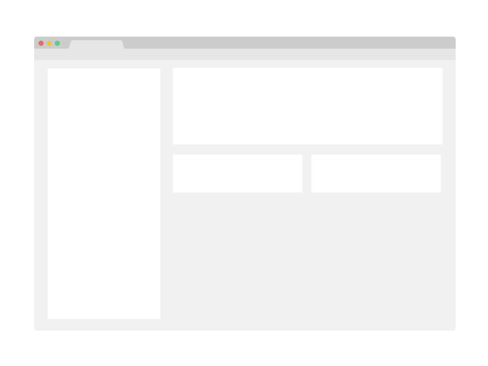

     

  

### Best-README-Template

An awesome README template to jumpstart your projects!  
[**Explore the docs »**](https://github.com/bgoonz/Best-README-Template)  
  
[View Demo](https://github.com/bgoonz/Best-README-Template) · [Report Bug](https://github.com/bgoonz/Best-README-Template/issues) · [Request Feature](https://github.com/bgoonz/Best-README-Template/issues)

Table of Contents

1.  [About The Project](#about-the-project)
    -   [Built With](#built-with)
2.  [Getting Started](#getting-started)
    -   [Prerequisites](#prerequisites)
    -   [Installation](#installation)
3.  [Usage](#usage)
4.  [Roadmap](#roadmap)
5.  [Contributing](#contributing)
6.  [License](#license)
7.  [Contact](#contact)
8.  [Acknowledgements](#acknowledgements)

About The Project
-----------------

There are many great README templates available on GitHub, however, I didn’t find one that really suit my needs so I created this enhanced one. I want to create a README template so amazing that it’ll be the last one you ever need – I think this is it.

Here’s why: \* Your time should be focused on creating something amazing. A project that solves a problem and helps others \* You shouldn’t be doing the same tasks over and over like creating a README from scratch \* You should element DRY principles to the rest of your life :smile:

Of course, no one template will serve all projects since your needs may be different. So I’ll be adding more in the near future. You may also suggest changes by forking this repo and creating a pull request or opening an issue. Thanks to all the people have have contributed to expanding this template!

A list of commonly used resources that I find helpful are listed in the acknowledgements.

### Built With

This section should list any major frameworks that you built your project using. Leave any add-ons/plugins for the acknowledgements section. Here are a few examples. \* [Bootstrap](https://getbootstrap.com) \* [JQuery](https://jquery.com) \* [Laravel](https://laravel.com)

Getting Started
---------------

This is an example of how you may give instructions on setting up your project locally. To get a local copy up and running follow these simple example steps.

### Prerequisites

This is an example of how to list things you need to use the software and how to install them. \* npm `sh   npm install npm@latest -g`

### Installation

1.  Get a free API Key at <https://example.com>
2.  Clone the repo

        git clone https://github.com/your_username_/Project-Name.git

3.  Install NPM packages

        npm install

4.  Enter your API in `config.js`

        const API_KEY = 'ENTER YOUR API';

Usage
-----

Use this space to show useful examples of how a project can be used. Additional screenshots, code examples and demos work well in this space. You may also link to more resources.

*For more examples, please refer to the [Documentation](https://example.com)*

Roadmap
-------

See the [open issues](https://github.com/bgoonz/Best-README-Template/issues) for a list of proposed features (and known issues).

Contributing
------------

Contributions are what make the open source community such an amazing place to be learn, inspire, and create. Any contributions you make are **greatly appreciated**.

1.  Fork the Project
2.  Create your Feature Branch (`git checkout -b feature/AmazingFeature`)
3.  Commit your Changes (`git commit -m 'Add some AmazingFeature'`)
4.  Push to the Branch (`git push origin feature/AmazingFeature`)
5.  Open a Pull Request

License
-------

Distributed under the MIT License. See `LICENSE` for more information.

Contact
-------

Your Name - \[@your\_twitter\](https://twitter.com/your\_username) - email@example.com

Project Link: <https://github.com/your_username/repo_name>

Acknowledgements
----------------

-   [GitHub Emoji Cheat Sheet](https://www.webpagefx.com/tools/emoji-cheat-sheet)
-   [Img Shields](https://shields.io)
-   [Choose an Open Source License](https://choosealicense.com)
-   [GitHub Pages](https://pages.github.com)
-   [Animate.css](https://daneden.github.io/animate.css)
-   [Loaders.css](https://connoratherton.com/loaders)
-   [Slick Carousel](https://kenwheeler.github.io/slick)
-   [Smooth Scroll](https://github.com/cferdinandi/smooth-scroll)
-   [Sticky Kit](http://leafo.net/sticky-kit)
-   [JVectorMap](http://jvectormap.com)
-   [Font Awesome](https://fontawesome.com)
