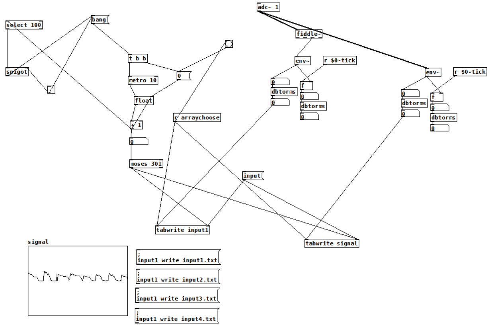
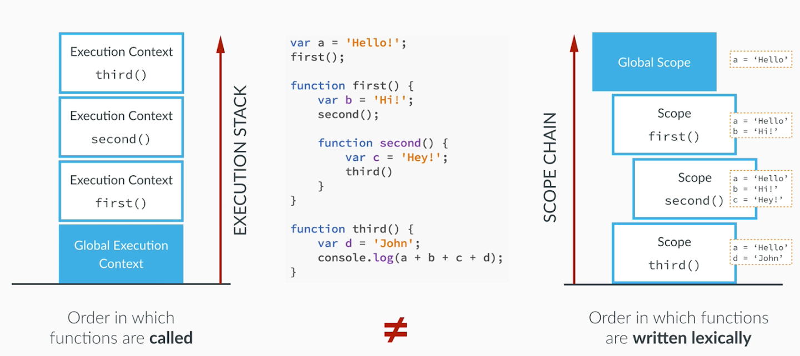
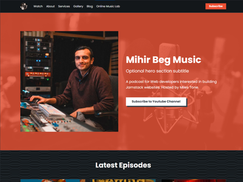
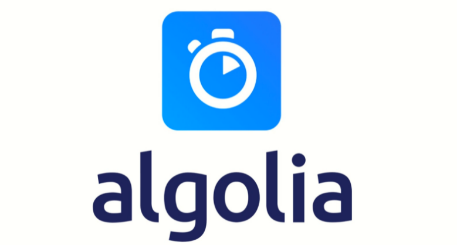
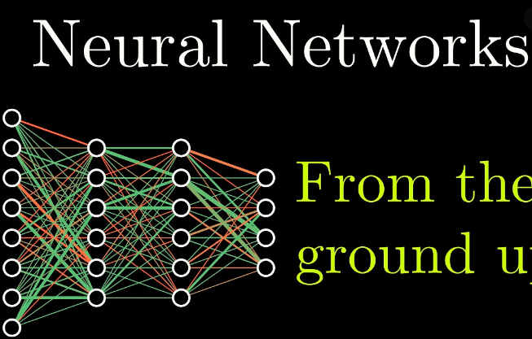
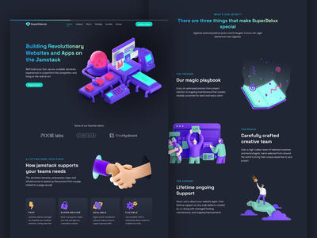
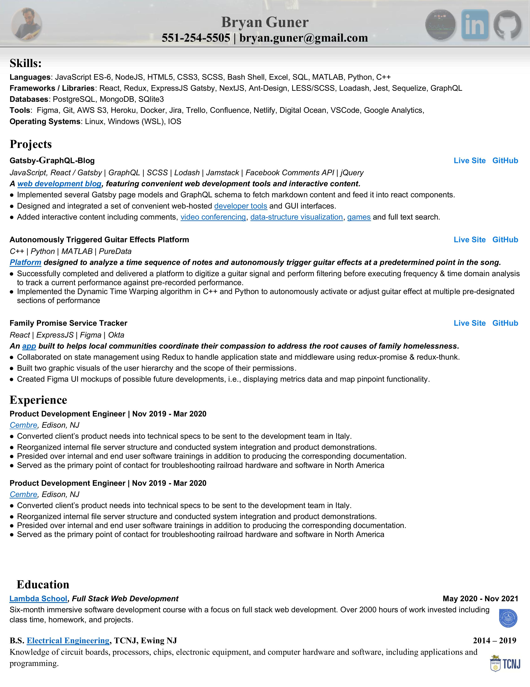
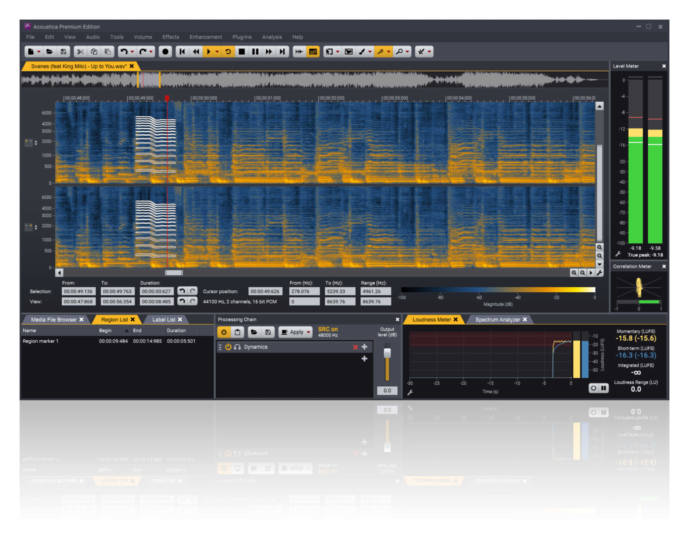

This app works best with JavaScript enabled.

Open Menu

- <a href="docs/sitemap/index.html" class="button">Navigation</a>
  Sub-menu

  - <a href="docs/index.html" class="button">Docs</a>
  - <a href="showcase/index.html" class="button">Showcase</a>
  - <a href="docs/faq/contact/index.html" class="button">Contact!</a>
  - <a href="docs/python/python-ds/index.html" class="button">Python</a>

- <a href="blog/index.html" class="button">Blog</a>
  Sub-menu

  - <a href="../bgoonz.blogspot.com/index.html" class="button">Blog-Post-Archive</a>
  - <a href="../blog-w-comments.vercel.app/index.html" class="button">Top Blog Posts</a>
  - <a href="blog/platform-docs/index.html" class="button">platform docs</a>
  - <a href="docs/articles/nodejs/index.html" class="button">nodejs</a>
  - <a href="blogWcomments/index.html" class="button">Blog w Comments</a>

- <a href="../github.com/bgoonz/UsefulResourceRepo2.html" class="button">Archive</a>
  Sub-menu

  - <a href="../github.com/Archive-42/Learning-Assets.html" class="button">Resource-Archive-Server</a>
  - <a href="../lambda-resources.netlify.app/index.html" class="button">Bootcamp Resources</a>
  - <a href="../web-dev-resource-hub.netlify.app/index.html" class="button">OG-Blog</a>
  - <a href="docs/gallery/index.html" class="button">Gallery</a>
  - <a href="docs/index.html" class="button">Top Repos</a>
  - <a href="../bryan-guner.gitbook.io/my-docs/index.html" class="button">MY_DOCS</a>

- <a href="../project-portfolio42.netlify.app/index.html" class="button">Projects</a>
  Sub-menu

  - <a href="../potluck-landing.netlify.app/index.html" class="button">Potluck Planner</a>
  - <a href="../meditate42app.netlify.app/index.html" class="button">Meditation App</a>
  - <a href="../panoramic-eggplant-452e4.netlify.app/index.html" class="button">WebAudioLab</a>
  - <a href="../bgoonz.github.io/searchAwesome/index.html" class="button">SearchAwesome</a>
  - <a href="../bg-portfolio.netlify.app/index.html" class="button">Condensed -Portfolio</a>
  - <a href="../a.familypromiseservicetracker.dev/index.html" class="button">Family Promise Tracker</a>
  - [DTW-Guitar-FX-Automation](../github.com/bgoonz/Revamped-Automatic-Guitar-Effect-Triggering.html)

- <a href="../bgoonz-blog-v3-0.netlify.app/index.html" class="button">External Nav</a>
  Sub-menu

  - <a href="../friendly-panda-b61ab.netlify.app/index.html" class="button">Embeds Blog</a>
  - <a href="../bgoonz-blog-v3-0.netlify.app/index.html" class="button">alt-blogs</a>
  - <a href="../bgoonz-games.netlify.app/index.html" class="button">Games</a>
  - <a href="../bgoonz-blog-v3-0.netlify.app/index.html" class="button">Blog Backup</a>
  - <a href="../bgoonz-cv.netlify.app/index.html" class="button">Cover Letter</a>
  - <a href="../project-portfolio42.netlify.app/index.html" class="button">Project Centric</a>
  - <a href="../web-dev-hub.com/index.html" class="button">Wordpress Blog</a>
  - <a href="../project-portfolio42.netlify.app/index.html" class="button">Project Portfolio Gallery</a>
  - <a href="../bgoonz.github.io/github-stats-website/index.html" class="button">github-stats-website</a>

- <a href="docs/tools/index.html" class="button">Tools</a>
  Sub-menu
  - <a href="../githtmlpreview.netlify.app/index.html" class="button">Github HTML Previewer</a>
  - <a href="../devtools42.netlify.app/index.html" class="button">Text Tools</a>
  - <a href="../ternary42.netlify.app/index.html" class="button">Ternary 2 If Else</a>
  - <a href="../determined-dijkstra-ee7390.netlify.app/index.html" class="button">Job Search Resources</a>
  - <a href="../github.com/bgoonz/web-dev-setup-checker.html" class="button">Setup Checker</a>
  - <a href="../potluck-landing.netlify.app/index.html" class="button">PotluckPlanner</a>
  - <a href="../web-dev-interview-prep-quiz-website.netlify.app/index.html" class="button">WebDev Quizzes</a>
  - Github-Advanced-Search

Close Menu

# I am a musician, electrical engineer & web developer

###### **A passionate student of web development from New Jersey U.S.A**

**Please note that this website is in development and is often broken!**

 

          

<a href="../sidebar-blog.netlify.app/contact/index.html" class="button button-secondary">Contact</a>

### [A Quick Guide To Big O](../medium.com/star-gazers/a-quick-guide-to-big-o-notation-memoization-tabulation-and-sorting-algorithms-by-example-803ff193c522.html)

Memoization, Tabulation, and Sorting Algorithms by Example Why is looking at runtime not a reliable method of calculating time complexity?

[Get Started](docs/index.html)

### [Python Guide](../levelup.gitconnected.com/python-study-guide-for-a-native-javascript-developer-5cfdf3d2bdfb40d8.html)

_Python has a built in help function that let’s you see a description of the source code without having to navigate to it… “-SickNasty … Autor Unknown” ._

[View Posts](../levelup.gitconnected.com/python-study-guide-for-a-native-javascript-developer-5cfdf3d2bdfb40d8.html)

### [Guitar Effects Triggering w DTW](../github.com/bgoonz/Revamped-Automatic-Guitar-Effect-Triggering.html)

[Learn More](docs/tools/index.html)

### [Beginner Guide React](../bryanguner.medium.com/introductory-react-part-2-cda01615a186.html)

As I learn to build web applications in React I will blog about it in this series in an attempt to capture the questions that a complete beginner might encounter that a more seasoned developer would take for granted!

### [Scope & Closure](../dev.to/bgoonz/scope-and-context-in-javascript-5cma.html)

Scope & Context in JS

The **scope** of a program in JavaScript is the set of variables that are available for use within the program.

### Web Audio Daw

PostgreSQL Cheat Sheet, Everything You Need to Get Started With VSCode + Extensions & Resources, Super Simple Intro To HTML, Understanding Git... etc....

## Current Interests

From github repositories to existential questions.

### [Angolia](angolia.html)

## Full Text Search

[Full Text Search](../www.algolia.com/index.html)

### [Convolutional Neural Networks](neural%20networks.html)

Artificial neural networks, usually simply called neural networks, are computing systems vaguely inspired by the biological [neural networks](../github.com/tensorflow/tensorflow.html)

### [Jamstack](jamstack.html)

## Why Jamstack

_Jamstack is the new standard architecture for the web. Using Git workflows and modern build tools, pre-rendered content is served to a CDN and made dynamic through APIs and serverless functions. Technologies in the stack include JavaScript frameworks, Static Site Generators, Headless CMSs, and CDNs._

### [Asynchronous JavaScript](lorem-ipsum.html)

The term **asynchronous** refers to two or more objects or events **not** existing or happening at the same time (or multiple related things happening without waiting for the previous one to complete). In computing, the word "asynchronous" is used in two major contexts.

### [NJ Devils](../www.allaboutthejersey.com/index.html)

# New Jersey Devils Hockey Team

### (Hockey in general)

## Team identity

The old green style jerseys used from 1982 to 1992The jerseys used from 1992 to 2017[Sean Avery](../en.wikipedia.org/wiki/Sean_Avery.html) of the [New York Rangers](../en.wikipedia.org/wiki/New_York_Rangers.html) attempts to distract Brodeur during the [2008 Stanley Cup playoffs](../en.wikipedia.org/wiki/2008_Stanley_Cup_playoffs.html). The playoff series was the fifth to feature the [Devils–Rangers rivalry](../en.wikipedia.org/wiki/Devils%e2%80%93Rangers_rivalry.html).

[lorem-ipsum](#)

### [ITER Fusion Reactor Experiment (Southern France)](lorem-ipsum.html)

# Break Even Nuclear Fusion Candidate

In December, researchers at the Joint European Torus (JET) started conducting fusion experiments with tritium — a rare and radioactive isotope of hydrogen. The facility is a one-tenth-volume mock-up of the US$22-billion ITER project and has the same doughnut-shaped ‘tokamak’ design — the world’s most developed approach to fusion energy. It is the first time since 1997 that researchers have done experiments in a tokamak with any significant amount of tritium.

## Resume & Portfolio

### [Resume](../raw.githubusercontent.com/bgoonz/resume-cv-portfolio-samples/master/2021-resume/bryan-guner-resume-2021.pdf)

[Learn More](../onedrive.live.com/redir1797.html)[Download PDF](#)

### Showcase

My Projects!

[Learn More](showcase/index.html)

## Blog-Archive-And-Mini-Projects

## Web Audio DAW

<a href="../mihirbegmusiclab.netlify.app/index.html" class="button">Go To Web Audio Daw</a>

## Quick Links

quick links home

### [About](docs/about/index.html)

Web-Dev-Hub is my personal blogand documentation site

[Learn More](docs/about/index.html)

### [Articles](docs/articles/index.html)

resources

[Learn More](docs/articles/index.html)

### [Audio](docs/audio/index.html)

Audio Projects

[Learn More](docs/audio/index.html)

### [Community](docs/community/index.html)

We'd love it if you participate in the Libris community. Find out how to get connected.

[Learn More](docs/community/index.html)

### [Content](docs/content/index.html)

In this section you'll learn how to add syntax highlighting, examples, callouts and much more.

[Learn More](docs/content/index.html)

### [Docs](docs/docs/index.html)

Documentation

[Learn More](docs/docs/index.html)

### [FAQ](docs/faq/index.html)

In this section you'll find commonly asked questions regarding the Libris theme. If you have questions, don’t hesitate to ask us directly.

[Learn More](docs/faq/index.html)

### [Javascript](docs/javascript/index.html)

Javascript articles and docs

[Learn More](docs/javascript/index.html)

### [Interactive](docs/interact/index.html)

feel free to try the examples

[Learn More](docs/interact/index.html)

### [Leetcode](docs/leetcode/index.html)

feel free to try the examples

[Learn More](docs/leetcode/index.html)

### [Medium](docs/projects/index.html)

We'd love it if you participate in the Web-Dev-Hubcommunity. Find out how to get connected.

[Learn More](docs/projects/index.html)

### [QuickRef](docs/quick-reference/index.html)

In this section you'll find basic information about Web-Dev-Hub and how to use it.

[Learn More](docs/quick-reference/index.html)

### [React](docs/react/index.html)

To make it easy to write documentation in plain Markdown, most React are styled using Markdown elements with few additional CSS classes.

[Learn More](docs/react/index.html)

### [Medium](docs/other-content/index.html)

We'd love it if you participate in the Web-Dev-Hubcommunity. Find out how to get connected.

[Learn More](docs/other-content/index.html)

### [Tools](docs/tools/index.html)

See some interesting tools developed by the Web-Dev-Hubcommunity to help automate parts of your workflow.

[Learn More](docs/tools/index.html)

### [Python](docs/python/index.html)

Python

[Learn More](docs/python/index.html)

### [Medium](docs/projects/index.html)

We'd love it if you participate in the Web-Dev-Hubcommunity. Find out how to get connected.

[Learn More](docs/projects/index.html)

### [Tutorials](docs/tutorials/index.html)

lorem-ipsum

[Learn More](docs/tutorials/index.html)

### [Reference](docs/reference/index.html)

lorem-ipsum

[Learn More](docs/reference/index.html)

### [Career](docs/career/index.html)

Reference materials and descriptions of fundamental concepts as well as visua

[Learn More](docs/career/index.html)

## Contact

get in touch! +1 (551) - 254 - 5505

<a href="docs/faq/contact/index.html" class="button">Contact</a><a href="mailto_bryan.guner%40gmail.html" class="button">email</a><a href="../webdevhub.jetbrains.space/oauth/auth/invite/419dd305ba717a392a02aa5b4e41e09c.html" class="button">Collaborate</a><a href="../www.youtube.com/channel/UC9-rYyUMsnEBK8G8fCyrXXAb5e7.html?sub_confirmation=1" class="button">Subscribe (Youtube)</a>

<table><colgroup><col style="width: 100%" /></colgroup><tbody><tr class="odd"><td><table><tbody><tr class="odd"><td style="text-align: left;"><a href="../search.freefind.com/siteindex3d75.html?si=14588965">index</a></td><td style="text-align: center;"><a href="../search.freefind.com/find8c28.html?si=14588965&amp;m=0&amp;p=0">sitemap</a></td><td style="text-align: right;"><a href="../search.freefind.com/findc8e7.html?si=14588965&amp;pid=a">advanced</a></td></tr></tbody></table></td></tr><tr class="even"><td><a href="../www.freefind.com/index.html">search engine</a><a href="../www.freefind.com/index.html">byfreefind</a></td></tr></tbody></table>

[Save to PDF](../pdfcrowd.com/index.html?)

@bgoonz on almost every platform<a href="../optimistic-lewin-8586ae.netlify.app/blm.zip" class="button">BLM</a>

Twitter

LinkedIn

GitHub

Youtube

Instagram

dev.to

{ // Let's set a variable for the number of pixels we are from the top of the document. const c = document.documentElement.scrollTop || document.body.scrollTop; // If that number is greater than 0, we'll scroll back to 0, or the top of the document. // We'll also animate that scroll with requestAnimationFrame: // https://developer.mozilla.org/en-US/docs/Web/API/window/requestAnimationFrame if (c &gt; 0) { window.requestAnimationFrame(scrollToTop1); // ScrollTo takes an x and a y coordinate. // Increase the '10' value to get a smoother/slower scroll! window.scrollTo(0, c - c / 10); } }; // When the button is clicked, run our ScrolltoTop function above! scrollToTopButton.onclick = function (e) { e.preventDefault(); scrollToTop1(); }

Back to top

